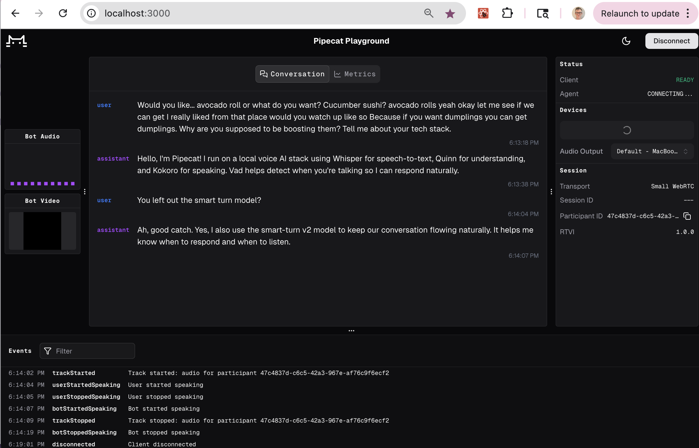

# Local voice agents on macOS with Pipecat



Pipecat is an open-source, vendor-neutral framework for building real-time voice (and video) AI applications.

This repository contains an example of a voice agent running with all local models on macOS. On an M-series mac, you can achieve voice-to-voice latency of <800 ms with relatively strong models.

The [server/bot.py](server/bot.py) file uses these models:

  - Silero VAD
  - smart-turn v2
  - MLX Whisper
  - Gemma3 12B
  - Kokoro TTS

But you can swap any of them out for other models, or completely reconfigure the pipeline. It's easy to add tool calling, MCP server integrations, use parallel pipelines to do async inference alongside the voice conversations, add custom processing steps, configure interrupt handling to work differently, etc.

The bot and web client here communicate using a low-latency, local, serverless WebRTC connection. For more information on serverless WebRTC, see the Pipecat [SmallWebRTCTransport docs](https://docs.pipecat.ai/server/services/transport/small-webrtc) and this [article](https://www.daily.co/blog/you-dont-need-a-webrtc-server-for-your-voice-agents/). You could switch over to a different Pipecat transport (for example, a WebSocket-based transport), but WebRTC is the best choice for realtime audio.

For a deep dive into voice AI, including network transport, optimizing for latency, and notes on designing tool calling and complex workflows, see the [Voice AI & Voice Agents Illustrated Guide](https://voiceaiandvoiceagents.com/).

# Models and dependencies

Silero VAD, MLX Whisper, and Kokoro all run inside the Pipecat process. When the agent code starts, it will need to download model weights that aren't already cached, so first startup can take some time.

The LLM service in this bot uses the OpenAI-compatible chat completion HTTP API. So you will need to run a local OpenAI-compatible LLM server. 

One easy, high-performance, way to run a local LLM server on macOS is [LM Studio](https://lmstudio.ai/). From inside the LM Studio graphical interface, go to the "Developer" tab on the far left to start an HTTP server.

# Run the voice agent

The core voice agent code lives in a single file: [server/bot.py](server/bot.py). There's one custom service here that's not included in Pipecat core: we implemented a local Kokoro TTS frame processor on top of the excellent [mlx-audio library](https://github.com/Blaizzy/mlx-audio).

```shell
cd server/

python -m venv venv
source venv/bin/activate

pip install -r requirements.txt

python bot.py
```

# Start the web client

The web client is a React app. You can connect to your local macOS agent using any client that can negotiate a serverless WebRTC connection. The client in this repo is based on [voice-ui-kit](https://github.com/pipecat-ai/voice-ui-kit) and just uses that library's standard debug console template.

```shell
cd client/

npm i

npm run dev

# Navigate to URL shown in terminal in your web browser
```